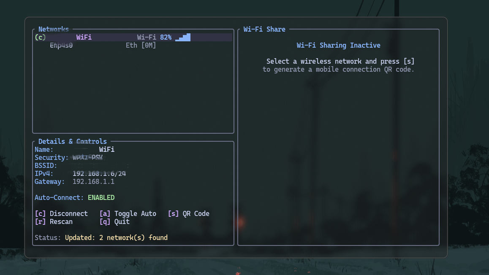
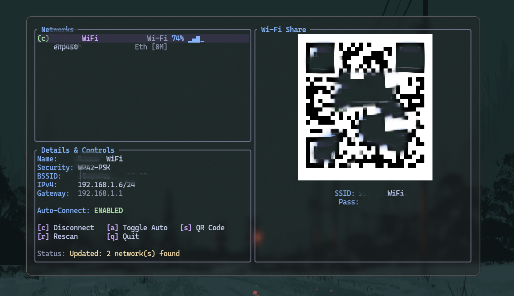

# WTUI

WTUI is a Rust based TUI for NetworkManager. It hopes to replace the old archaic looking TUI and replace it with a cleaner, modern interface.

The interface is built with modern wayland compositors in mind, and works well with transparency and blur effects as well. It is designed to inherit your terminal design to be in unison with your system (in case of ricing)


## Features

- **Direct NetworkManager D-Bus Integration**: Communicates directly over the system D-Bus using `zbus` for high performance and low latency without brittle shell command parsing.

- **Dual Wired & Wireless Support**: Introspects both Ethernet interfaces (link speed detection) and 802.11 Wi-Fi access points.

- **Dynamic Wi-Fi Signal Meters**: Visual signal strength indicators (`▂___`, `▂▄__`, `▂▄▆_`, `▂▄▆█`) along with percentage ratings.

- **Interactive Mobile QR Code Sharing**:
  - Automatically formats standard Wi-Fi configuration strings.
  - Renders pixel-crisp QR codes directly in your terminal.
  - Securely prompts for connection secrets via D-Bus secrets API or an ephemeral credential prompt fallback.

- **One-Key Connection & Profile Management**:
  - Connect / Disconnect active network devices.
  - Toggle autoconnect flags across saved NetworkManager connection profiles.
  - Trigger active wireless scans on demand.

- **Aesthetic UI**: Styled using the **Catppuccin Mocha** palette with rounded container borders and responsive split-pane layouts.


## Controls

| Key | Action |
| :--- | :--- |
| j / ↓ | Move selection down |
| k / ↑ | Move selection up |
| c | Connect / Disconnect selected network |
| a | Toggle connection autoconnect state |
| s | Toggle mobile Wi-Fi sharing QR code pane |
| r | Request a fresh Wi-Fi rescan |
| q / Esc | Exit application |


## Requirements

- **Network Agent**: This won't work for iwctl, strictly NetworkManager
- **Rust Toolchain**: Rust 1.70+ (recommended via [rustup](https://rustup.rs/)).
- **D-Bus & Polkit Permissions**: To view and manipulate connections and retrieve network secrets.


## Installation & Build

1. **Clone the repository:**
   ```bash
   git clone https://github.com/Arihasaheadache/wtui.git
   cd wtui
   ```

2. **Build from source:**
   ```bash
   cargo build --release
   ```

3. **Install binary to system path:**
   ```bash
   install -Dm755 target/release/wtui ~/.local/bin/wtui
   # or with cargo
   cargo install --path .

## Preview (Images blurred for privacy)

**INTERFACE**



**QR SECTION**




## License

This project is licensed under the [GNU General Public License v3.0](LICENSE).
